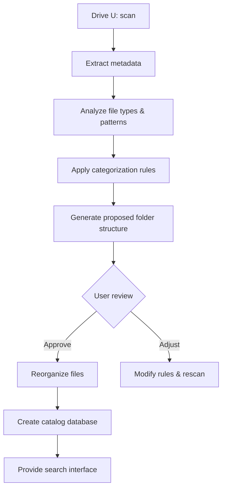

# File Organization System Plan

## Problem Statement
- Drive U: contains thousands of files currently organized by file extension (e.g., `_acr`, `_adsk`).
- This structure makes it difficult to locate files related to a specific project, topic, or date.
- User needs a systematic folder organization based on metadata, not just file type.
- Solution must run on Windows without installation (portable).

## Proposed Solution
A hybrid approach that combines **category‑based folders**, **date‑based subfolders**, and **project detection** where possible. The system will:
1. Keep the original files intact (or move them optionally).
2. Use a catalog database for search and virtual views.
3. Provide a script‑based tool that can be run from a USB stick.

## Architecture Overview



### Components

#### 1. **Scanner**
- Recursively traverses the drive.
- Collects for each file:
  - Path, size, extension
  - Creation date, modification date
  - File type category (document, image, code, CAD, etc.)
  - Optional: EXIF, Office metadata, project clues (folder names, keywords)

#### 2. **Categorizer**
- Maps file extensions to broad categories (see mapping table).
- Detects projects by looking for:
  - Folder groupings (files in same parent directory)
  - Naming patterns (e.g., `ProjectX_*`)
  - Timestamp clusters

#### 3. **Rule Engine**
- Configurable rules for organizing:
  - **By date**: `YYYY/MM` subfolders.
  - **By category**: `Documents/`, `Images/`, `CAD/`, `Code/`, `Archives/`.
  - **By software**: `AutoCAD/`, `Office/`, `Blender/`.
  - **By project**: `Projects/ProjectX/`.

#### 4. **Structure Generator**
- Proposes a new folder tree.
- Outputs a preview report (HTML/CSV) for user validation.

#### 5. **Reorganizer**
- Moves files to new locations (optional).
- Can create symbolic links or junction points to keep original paths accessible.
- Maintains a log for undo operations.

#### 6. **Catalog & Search**
- Builds a SQLite database with file metadata.
- Provides a simple web‑based or CLI search interface.

## Folder Structure Example

```
U:/
├── _Organized/                    # New root for reorganized files
│   ├── Categories/
│   │   ├── Documents/
│   │   │   ├── PDF/
│   │   │   ├── Word/
│   │   │   └── Excel/
│   │   ├── Images/
│   │   │   ├── Photos/
│   │   │   └── Graphics/
│   │   ├── CAD/
│   │   │   ├── DWG/
│   │   │   └── STEP/
│   │   ├── Code/
│   │   │   ├── Python/
│   │   │   └── Cpp/
│   │   └── Archives/
│   │       ├── ZIP/
│   │       └── RAR/
│   ├── Date/
│   │   ├── 2025/
│   │   │   ├── 01_January/
│   │   │   └── 02_February/
│   │   └── 2026/
│   ├── Projects/                  # If detected
│   │   ├── ProjectAlpha/
│   │   └── ProjectBeta/
│   └── Software/
│       ├── AutoCAD/
│       └── Office/
├── _Catalog/                      # Database and index
│   ├── files.db
│   └── search.html
└── _Original/                     # Backup of original structure (optional)
```

## Implementation Choices

### Technology Stack
- **Primary script**: Python 3 (portable via WinPython or embedded distribution).
- **Alternative**: PowerShell script for pure Windows (no Python install).
- **Database**: SQLite (single file, no server).
- **UI**: Simple HTML/JavaScript for search, or a console interface.

### Portability
- Package as a standalone `.exe` using PyInstaller (single executable, no installation).
- Or provide a batch file that launches a portable Python interpreter.

### Safety Features
- Dry‑run mode (preview only).
- Undo capability via transaction log.
- Backup of original files before moving.

## Actionable Steps

1. **Inventory current files** – write a script to scan U:\ and export CSV.
2. **Design categorization mapping** – define which extensions belong to which categories.
3. **Build rule engine** – implement configurable rules (YAML/JSON).
4. **Generate proposed structure** – produce a visual map.
5. **Create user‑review interface** – allow adjustments.
6. **Implement file mover** – with safety checks.
7. **Build catalog database** – index metadata.
8. **Develop search interface** – simple web app.
9. **Package as portable tool** – create executable and documentation.

## Next Steps
- Review this plan with the user.
- Adjust based on feedback.
- Switch to Code mode to start implementation.