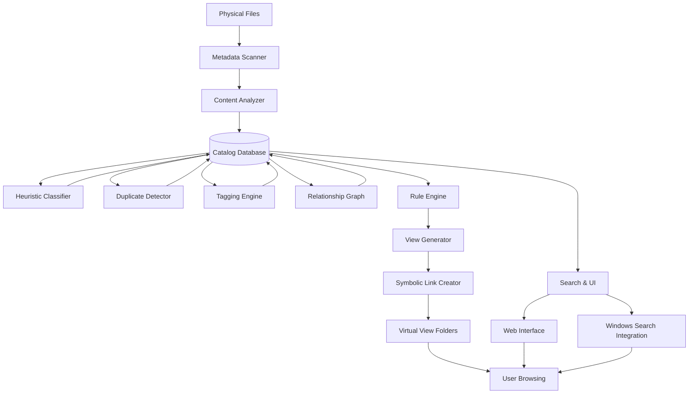

# Virtual Organization System – Advanced Non‑AI Plan

## Goal
Create a sophisticated, multi‑perspective virtual file organization system that leverages metadata, heuristics, and rule‑based analysis to provide intelligent views, deduplication, tagging, and search—all without moving or duplicating files, and without requiring AI/ML.

## Core Innovations (No AI)
1. **Heuristic Content Classification** – categorizes files using extension, file headers, and simple pattern matching (e.g., “invoice” in filename).
2. **Duplicate Detection & Deduplication** – identifies identical files via hashing and optionally replaces them with hard links to save space.
3. **Smart Tagging Engine** – allows manual and rule‑based automatic tagging; tags propagate across all views.
4. **Relationship Graph** – detects related files (e.g., CAD drawing + PDF print + render) using references, folder proximity, and timestamps.
5. **Custom View Definition Language** – users can create arbitrary views using a simple SQL‑like query language.
6. **Real‑Time Monitoring** – watches for new/changed files and updates views automatically (optional).
7. **Integration with Windows Search** – makes virtual views searchable via the OS.
8. **Advanced Project Detection** – clustering based on folder hierarchy, naming patterns, and timestamp clusters.
9. **Content‑Aware Views** – uses extracted text (from documents) and EXIF data (from images) to create smart categories.

## Virtual Views (Enhanced)

### 1. **By Category (Rule‑Based)**
- Uses a configurable mapping of extensions to broad categories (Documents, Images, CAD, Code, Archives, Media).
- Sub‑categories based on filename patterns (e.g., `*invoice*` → `Documents/Invoices/`).
- Supports custom regex rules for user‑defined categories.

### 2. **By Date (Smart)**
- Automatically extracts date from filename (common patterns like `YYYY‑MM‑DD`, `IMG_YYYYMMDD`).
- Supports multiple date facets: creation, modification, content date (EXIF).
- Groups by year/month/week/day as configurable.

### 3. **By Project (Advanced Heuristic)**
- Cluster files by:
  - Folder hierarchy (common parent directory).
  - Timestamp proximity (files created within a 7‑day window).
  - Filename prefixes (e.g., `ProjectX_*`).
  - Presence of project marker files (`.git`, `package.json`, `.sln`).

### 4. **By Software & Version**
- Maps file extensions to known applications (AutoCAD, Office, Blender, etc.).
- Extracts version info from binary headers (where possible) using `pefile` for EXE/DLL.

### 5. **By Size (Dynamic Bins)**
- Adaptive binning based on overall distribution (percentiles).
- User‑definable thresholds.

### 6. **By Usage Pattern**
- Combines last‑access time, frequency of access (from NTFS USN journal if enabled), and user‑defined importance.

### 7. **By Relationship Graph**
- Groups files that reference each other:
  - Source code includes (`#include`, `import`, `require`).
  - Hyperlinks in documents (PDF, HTML).
  - Similar timestamps and folder proximity.
- Creates “project bundles” that can be viewed as a unit.

### 8. **By Content Keywords**
- Extracts text from documents (PDF, DOCX, TXT) and indexes keywords.
- Allows views like “Documents containing ‘budget’”.

### 9. **Custom Views (User‑Defined)**
- Using a simple query language:
  ```
  view "Large PDFs 2025" {
    filter extension = "pdf" and size > 5MB and year(created) = 2025
    sort by size desc
    group by month(created)
  }
  ```

## System Architecture



### Components (Detailed)

#### 1. **Metadata Scanner**
- Fast, parallel traversal using `os.scandir`.
- Extracts all NTFS attributes, alternate data streams (ADS), and shell properties.
- Outputs to SQLite with incremental update support.

#### 2. **Content Analyzer**
- Extracts text from documents (PDF, DOCX, ODT, TXT) using `python‑docx`, `PyPDF2`, `textract`.
- Extracts EXIF, IPTC, XMP from images (`PIL`, `exifread`).
- Parses source code for imports, dependencies, and comments.
- Indexes keywords for full‑text search.

#### 3. **Heuristic Classifier**
- Rule‑based classification using:
  - Extension mapping (configurable YAML).
  - Filename pattern matching (regex).
  - File header magic numbers.
  - Simple keyword detection in extracted text.

#### 4. **Duplicate Detector**
- Computes SHA‑256 of file content (optional: partial hashing for large files).
- Groups duplicates and presents a report.
- Optionally replace duplicates with hard links (saves space, safe).

#### 5. **Tagging Engine**
- Stores tags in database (`file_tags`).
- Tags can be assigned manually (via UI) or automatically (by rules).
- Tags are first‑class citizens in views and search.

#### 6. **Relationship Graph**
- Builds a graph of file relationships based on:
  - References in source code (`#include`, `import`).
  - Hyperlinks in documents.
  - Similar timestamps and folder proximity.
- Exposes graph via a simple API for navigation.

#### 7. **Rule Engine**
- YAML‑based configuration.
- Supports JavaScript‑like expressions for custom logic.
- Example rule: `category = "Invoice" if filename contains "invoice"`.

#### 8. **View Generator**
- Computes virtual paths for each file in each view.
- Handles conflicts via deterministic unique suffixes.
- Generates preview as interactive HTML report.

#### 9. **Symbolic Link Creator**
- Uses `win32file` to create symbolic links (requires admin privilege) or junction points (no admin).
- Maintains a transaction log with undo capability.

#### 10. **Search Interface**
- Single‑page React app (bundled with the executable).
- Full‑text search on extracted text.
- Faceted filtering by metadata, tags, categories, dates, size, etc.
- Direct file open, copy path, reveal in Explorer.

#### 11. **Windows Search Integration**
- Creates a Windows Search connector (optional) that indexes virtual views.
- Allows native Windows search (`Win+S`) to find files in views.

## Implementation Roadmap

### Phase 0: Preparation
1. **Portable Python distribution** – embed Python 3.11 with required libraries.
2. **Create project skeleton** – modular package structure.

### Phase 1: Core Scanning & Database
3. **Implement metadata scanner** with progress bar.
4. **Design SQLite schema** (files, duplicates, tags, relationships, keywords).
5. **Build basic category mapping** (extension → category).

### Phase 2: Advanced Metadata Extraction
6. **Integrate text extraction** for common document formats.
7. **Add EXIF extraction** for images.
8. **Implement duplicate detection** (SHA‑256).

### Phase 3: Heuristic Classification & Tagging
9. **Develop heuristic classifier** with configurable rules.
10. **Build tagging engine** with rule‑based auto‑tagging.
11. **Implement relationship graph** (basic version).

### Phase 4: View Generation & Links
12. **Develop rule engine** and view generator.
13. **Implement symbolic‑link creation** with transaction log.
14. **Create dry‑run preview** (HTML report).

### Phase 5: User Interface
15. **Build React frontend** (bundled with `pywebview` or served via Flask).
16. **Implement search and filtering**.
17. **Add tagging UI** (assign/remove tags).

### Phase 6: Polish & Integration
18. **Windows Search connector** (optional).
19. **Real‑time monitoring** (watchdog).
20. **Performance optimization** (database indexes, caching).

### Phase 7: Packaging & Testing
21. **Package as standalone `.exe`** using PyInstaller (include UI assets).
22. **Create installer** (Inno Setup) for easy deployment.
23. **Test on subset of U:\** (60,000 files) and gather feedback.

## Safety & Robustness
- **Dry‑run mandatory** – user must approve plan before any links are created.
- **Undo/rollback** – transaction log allows complete reversal.
- **Backup of critical metadata** – catalog database can be exported/imported.
- **No modifications to originals** – all operations are non‑destructive (except optional deduplication via hard links, which is safe).
- **Conflict resolution** – automatic renaming with user‑visible logs.

## Deliverables
1. `FileOrganizer.exe` – standalone executable (≈50 MB with embedded Python and UI).
2. `config/` – YAML configuration files for views, rules, and categories.
3. `catalog.db` – SQLite database with full metadata, tags, and relationships.
4. `views/` – generated virtual directories (symbolic links).
5. `webui/` – portable web interface (can run offline).
6. `docs/` – user manual, API reference, and troubleshooting.

## Next Steps
- Review this advanced non‑AI plan.
- Prioritize features (what’s essential vs. nice‑to‑have).
- Switch to Code mode and begin implementation.